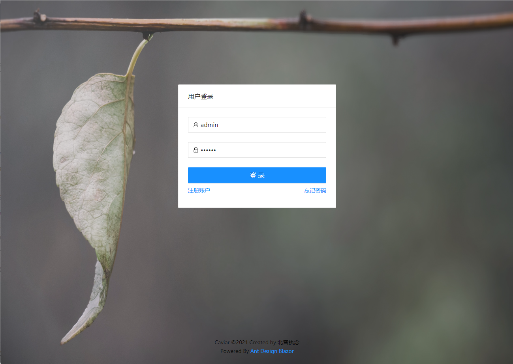
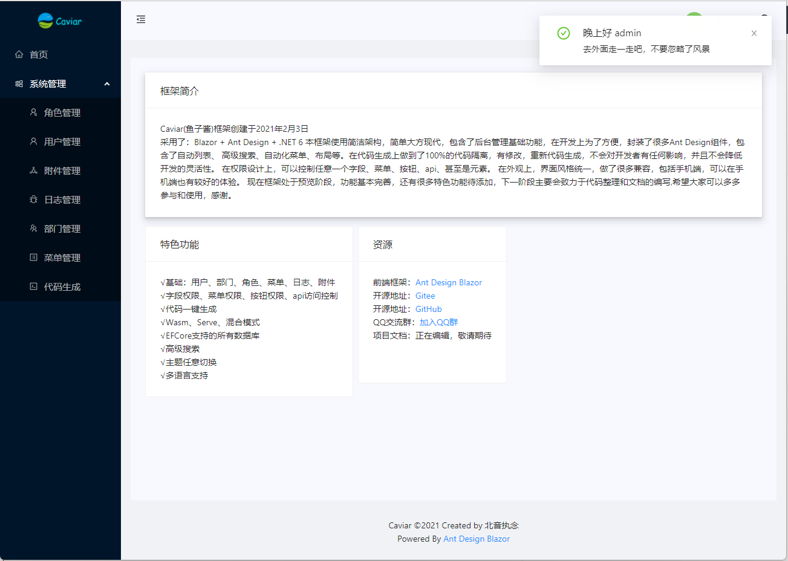
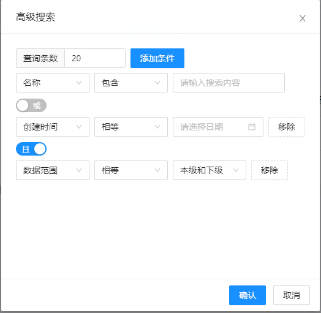
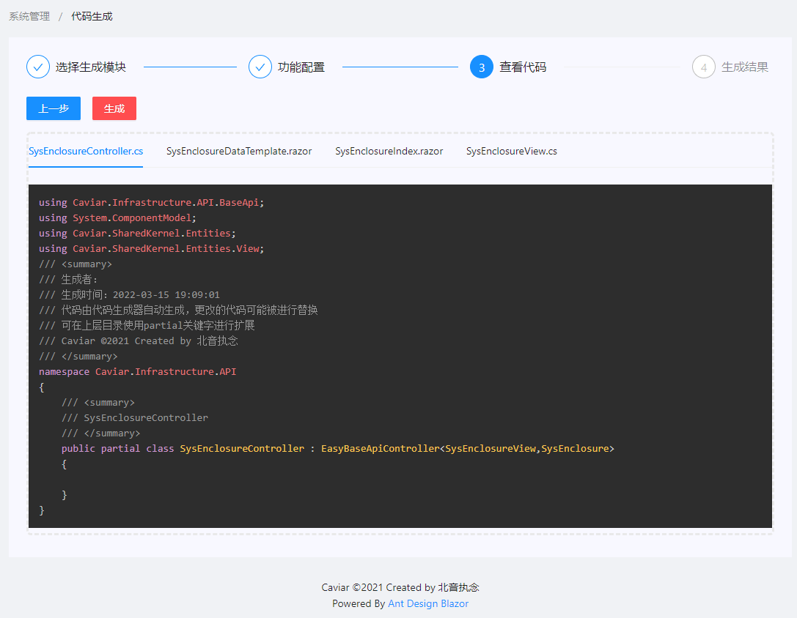
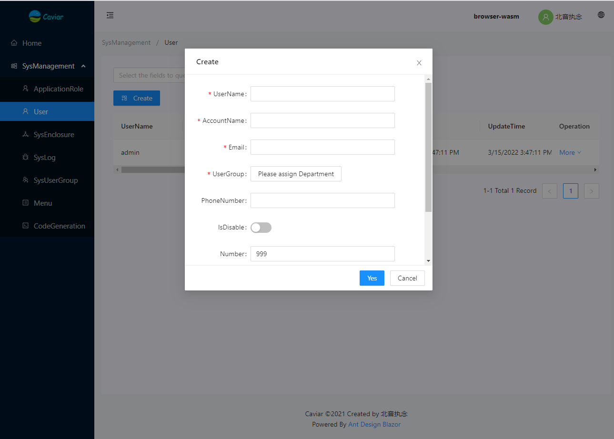
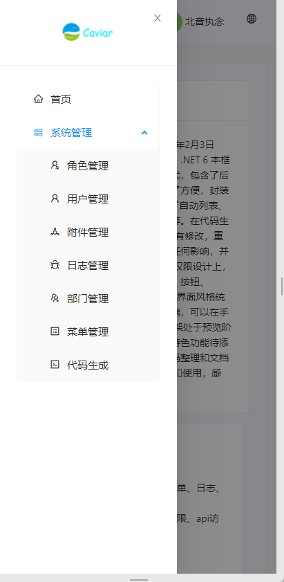

  

<h1 align="center">Caviar Blazor</h1>
Caviar(鱼子酱)框架采用了：Blazor + Ant Design + .NET6 本框架使用简洁架构，简单大方现代，包含了后台管理基础功能，在开发上为了方便，封装了很多Ant Design组件，包含了自动列表、高级搜索、自动化菜单、布局等。在代码生成上做到了100%的代码隔离，有修改，重新代码生成，不会对开发者有任何影响，并且不会降低开发的灵活性。在权限设计上，可以控制任意一个字段、菜单、按钮、api、甚至是元素。在外观上，界面风格统一，做了很多兼容，包括手机端，可以在手机端也有较好的体验。现在框架处于预览阶段，功能基本完善，还有很多特色功能待添加，下一阶段主要会致力于代码整理和文档的编写,希望大家可以多多参与和使用，感谢。

## ✨ 特性  

- 🌈 代码生成器一键自动生成前后端，生成代码做到100%隔离，无需担心代码混乱。  
- 🏁 拥有字段权限、数据权限、菜单权限、按钮权限，甚至可以细化到元素权限。  
- 📦 开箱即用的高质量框架，封装了多个Ant Design组件简化使用过程
- 📱 兼容PC、手机、Ipad，一处运行，到处使用
- 💕 支持 WebAssembly、Server、混合模式
- ⚙️ 支持多种数据库：EFCore支持的数据库都支持
- 🎁 内置日志管理、菜单管理、附件管理、部门管理、用户管理、角色管理、代码生成等
- 💿 多种主题任意切换
- ⭕️ 高级搜索，支持任意模型，生成即用
- 🆎 多语言支持，任意语言配置即可使用

## 🍬 混合模式

- 大家都应该了解Server模式和Wasm模式的优缺点，本框架结合两种模式的优点，做到启动时使用server模式快速加载，使用时自动无感切换到Wasm模式节省资源。
并且可以自由切换，只需要写一次，两种模式同时支持

## 🔗 链接

- <a target='_blank' href='http://81.70.80.113/'>演示地址</a>  
  用户名：admin  
  密码：123456  
  由于刚搭建好，很多功能没有限制，大家想测试可以自行创建数据进行测试，就不要删除原先的数据了，感谢！  
- 项目文档正在编写，敬请期待
- [Ant Design](https://ant-design-blazor.gitee.io/zh-CN/)

## ☀️ 第一次点亮
- 1、首先下载源代码解压后，打开Caviar.sln。  
  2、如果以前有运行过代码，请先打开SqlServer资源管理器，连接到本地数据库【(localdb)\MSSQLLocalDB】，找到Caviar_db数据库后删除就可以了。  
  3、把Caviar.Demo.Hybrid设定为启动项即可。  
  4、F5启动后会自动打开，第一次启动loading会比较长，请耐性等待。  
  5、如果无法启动可以加入QQ群进行联系。  

## 🍡 使用环境

- .NET 6
- Ant Design：最新版
- Visual Studio 2022
- 任意数据库

|   Edge / IE |  Firefox |  Chrome |  Safari |  Opera |  Electron |
| :-------------------------------------------------------------------------------------------------------------------------------------------------------------------------------------------------: | :--------------------------------------------------------------------------------------------------------------------------------------------------------------------------------------------------: | :----------------------------------------------------------------------------------------------------------------------------------------------------------------------------------------------: | :----------------------------------------------------------------------------------------------------------------------------------------------------------------------------------------------: | :------------------------------------------------------------------------------------------------------------------------------------------------------------------------------------------: | :------------------------------------------------------------------------------------------------------------------------------------------------------------------------------------------------------: |
|                                                                                          Edge 16 / IE 11†                                                                                           |                                                                                                 522                                                                                                  |                                                                                                57                                                                                                |                                                                                                11                                                                                                |                                                                                              44                                                                                              |                                                                                               Chromium 57                                                                                                |

> 由于 [WebAssembly](https://webassembly.org) 的限制，Blazor WebAssembly 不支持 IE 浏览器，但 Blazor Server 支持 IE 11†。 详见[官网说明](https://docs.microsoft.com/en-us/aspnet/core/blazor/supported-platforms?view=aspnetcore-3.1&WT.mc_id=DT-MVP-5003987)。

## 🏁 项目截图

## 🍻 社区互助

- 如果在使用过程中遇到任何问题，可以通过以下途径解决，我定当竭尽所能

## 🌠 授权协议

框架处于预览阶段，正在补齐开发、使用、部署等文档，等文档齐全，随即发布正式版
